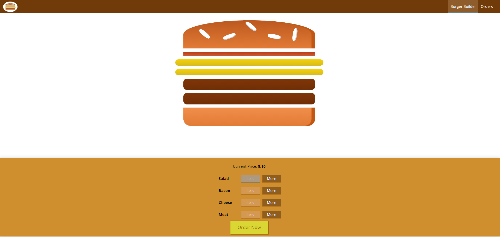

# Burger Builder

## Learning more of React and Redux with this web app.

### what can you do?
- Build your burger and watch the ingredients in action.
- go to checkout and fill your data.
- see all the orders.

### For this project I used:

- React.
- React Router.
- Redux with async functions.
- Firebase hosting and realtime database.
- axios.
- CSS Modules.

There is a link attached above. have fun!.

